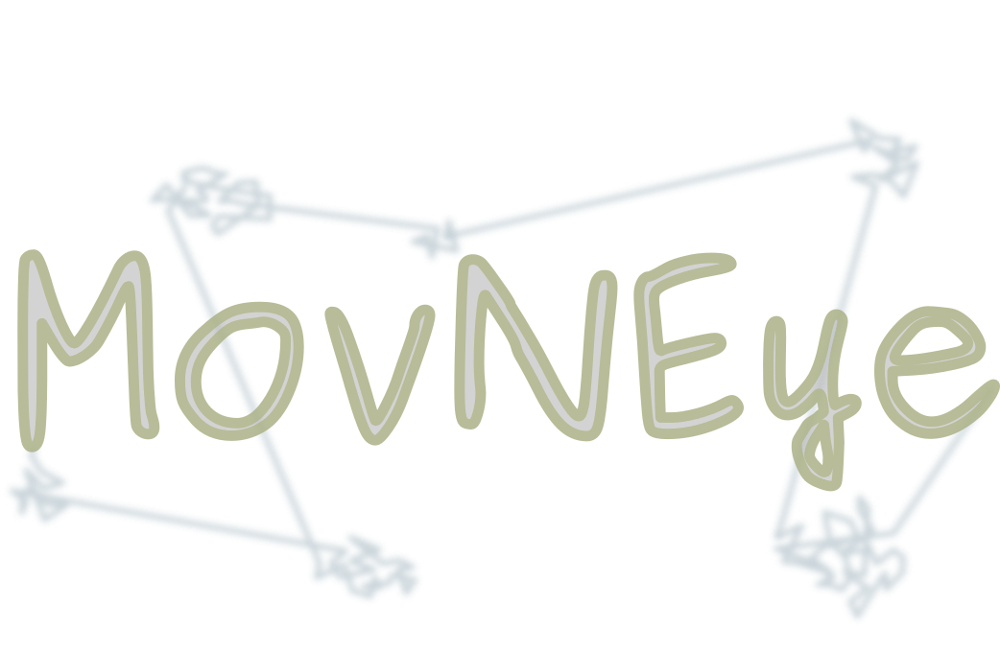

<p align="center">
  
</p>

---

**_MovNEye_**  stands for "_Moving a Neuromorphic Eye_".
It is a tool to facilitate the neuromorphic community in the exhausting task of converting static computer-vision
datasets to their event-based counterparts. It requires a neuromorphic vision camera (DAVIS, dynamic and active vision 
sensor) mounted on top of two servo-motors (PTU, pant-tilt unit), driven by taking inspiration from natural viewing
during fixation (FEMs, fixational eye movements). The system converts static images into spike trains by exploiting a 
silicon retina and human's dynamic fixational strategies (specifically, a microscopic and randomly-drifting motion pattern).

---
## Motivation

I firmly believe that research in neuromorphic computing would be strongly accelerated from building 
large and natively-spiking benchmarks.
First, having extensive datasets is extremely important for offline training of neural networks, 
hence facilitating the design of novel and more performant learning algorithms and architectures. 
Indeed, challenges such as ImageNet drove significant advances in deep learning for computer vision. 
Nowadays, standard computer-vision datasets hence dominate the benchmarks in neuromorphic research as well, 
although they do not require the native temporal processing capabilities of spiking neurons, 
and as such do not showcase their full potentialities.
Event-based sensors, instead, represent the natural solution for suitably encoding external information 
to the spiking domain, i.e. through sparse and noisy events with highly precise timings. 
It is therefore mandatory that visual information is gathered using a neuromorphic sensor, 
therefore producing natively-spiking vision datasets.
But since neuromorphic cameras require a relative motion with the scene in order to generate data, 
a stationary environment must be actively scanned by the sensor. 
Notably, similar to biology, the acquisition strategy plays a central role on structuring complex 
spatio-temporal streams of events resulting from the sensor. 
Therefore, exploring different active-sensing patterns may be beneficial for neuromorphic computing, 
in the aim of finding the one that provides the most informative code.
Furthermore, N-MNIST is so far the largest natively-neuromorphic dataset most widely adopted for 
benchmarking SNNs on vision tasks, counting 70k samples, 10 classes and a triangular acquisition pattern. 
Most of the algorithms produced for neuromorphic vision have been trained for solving it, 
hence the benefits it brought to the community are undeniable. 
However, new and larger datasets, bringing novel and more challenging tasks, are now becoming essential. 
Neuromorphic vision does not yet have a well-defined and truly-challenging task that the entire community 
is attempting to solve. 
One of the reasons is that building large-scale event-based datasets is not a trivial task, 
being it time-consuming, tedious and requiring specific knowledge.
Hence, this repository provides convenient tools for converting large-scale static computer-vision datasets 
to their neuromorphic counterpart using an event-based sensor and some chosen motion pattern. 
As I have personally tested in my research activity, automating the acquisition process dramatically reduces 
the effort of building a neuromorphic dataset.
The aim of this repository is therefore to provide general tools for defining a recording pipeline, 
hopefully facilitating the process of building more and more benchmarks for ultimately training networks 
to face new and diverse challenges.
However, since this toolkit was developed as an intermediate step of my research project, 
it currently only supports the specific hardware I adopted, that is described underneath. 
Nonetheless, it could still serve as a methodological basis for facilitating future work 
of researchers dealing with similar problems as mine, even though with a slightly different setup. 

---

## Hardware requirements
- neuromorphic vision sensor DAVIS-346 from IniVation SpA
- pan-tilt unit device PTU-E46 from FLIR SpA

## Software requirements
- python >= 3.6
- pyserial
- numpy
- pyaer
- opencv-python
- tensorflow-datasets
- matplotlib
- pandas
- scipy
- tqdm
- ssl

## Guidelines
The DAVIS sensor should be mounted on top of the PTU and placed in front of a monitor. Note that the whole screen
should _entirely_ fall in the DAVIS field-of-view. All three devices must be serially connected to a host computer
running scripts from this repository. It is recommended to encapsulate the whole DAVIS-PTU-monitor system into a
dark enclosure in order to avoid for external light sources corrupting the recordings. The host PC should be left
outside the enclosure, for external control by an operator.

The recording process should consist of 6 main phases:
1) calibration both of the sensor optics (calib-2D) and homography of the camera-monitor system (calib-3D)
2) generation of FEM sequences
3) data recording
4) data diagnostics, analysis and errors correction
5) data preprocessing and packaging
6) data visualization

## Important notes (for many subsequent recordings)
If you want to record a large dataset all in one (or few) recording slots, the DAVIS camera will be connected to the
host PC and active for a long time. This prevents the sensor from ever cooling down and, after a set of recordings, the
temperature of the chip will be too high and lots of noise will be generated (possibly inducing some problems in the
data collected, such as holes in the event flow for some data packets being removed from the USB bus). Despite catching
these problems afterwards with the data diagnostic tool (and re-recording them), it is better to reduce them in the
first place. To do so, a possible strategy is to alternatively stop recording after a set of data is collected and
disconnecting the USB port of the DAVIS sensor during such pause (letting the chip cooling down during such pause).
Thus, you can take advantage of the functions inside the files of the _usb_ folder, which allow you to control the power
of a USB port in order to deactivate and reactivate it after some time period. Anyhow, you must note that controlling
the power of a USB port requires super-user permissions, therefore the sudo password will be required when calling these
functions. To avoid having to prompt the sudo password every time, the USB port must be deactivated. Thus, you should
change the time limit for a sudo session. You can then call the function in _powercontrol.py_ and only have to insert
the password when calling it the first time. Note that you should change the sudoers file. Check the notes at the
beginning of the python file for more detailed instructions.

## Limitations
- the code was only tested under an Ubuntu Linux environment with both distributions 18.04 and 20.04.
- there could be issues with serial communications due to super-user permissions, required by the system. Either run the code with
sudo or check out [this link](https://www.xmodulo.com/change-usb-device-permission-linux.html) for a permanent solution.

## Citation
If you find this package helpful, please consider citing:

```BibTex
```
