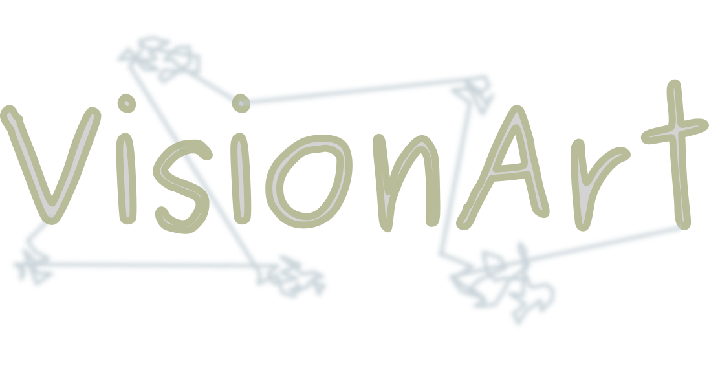

---

**_VisionArt_**  stands for: "_VIewing Static Images On Neuromorphic Artificial Retinas with Tremors_".
It is a tool to facilitate the neuromorphic community in the exhausting task for converting static image-classification
datasets to their event-based counterparts. It requires a neuromorphic vision camera (DAVIS, dynamic and active vision 
sensor) mounted on top of 2 servo-motors (PTU, pant-tilt unit), driven by taking inspiration from natural viewing during
fixation (FEMs, fixational eye movements). The system converts the static images into spike trains by exploiting a 
silicon retina and human's dynamic fixational strategies (a trembling motion).

---

## Hardware requirements
- neuromorphic vision sesnsor DAVIS-346 (red) from IniVation SpA
- pan-tilt unit device PTU-E46 from FLIR SpA

## Software requirements
- python >= 3.6
- pyserial
- numpy
- pyaer
- opencv-python
- tensorflow-datasets
- matplotlib
- pandas
- scipy
- tqdm
- ssl

## Guidelines
The DAVIS sensor should be mounted on top of the PTU and placed in front of a monitor. Note that the whole screen
should _entirely_ fall in the DAVIS field-of-view. All three devices must be serially connected to a host computer
running scripts from this repository. It is recommended to encapsulate the whole DAVIS-PTU-monitor system into a
dark enclosure in order to avoid for external light sources corrupting the recordings. The host pc should be left
outside the enclosure, for external control by an operator.

The recording process should consist of 5 main phases:
1) calibration of both the sensor's optics (calib-2D) and of the camera-monitor system (calib-3D)
2) generation of FEM sequences
3) data recording
4) data diagnostics, analysis and errors correction
5) data preprocessing and packaging
6) data visualization

## Important notes (for many subsequent recordings)
If you want to record a large dataset all in one (or few) recording slots, the DAVIS camera will be connected to the
host pc and active for a long time. This prevents the sensor from ever cooling down and, after a set of recordings, the
temperature of the chip will be too high and lots of noise will be generated (possibly inducing some problems in the
data collected, such as holes in the event flow for some data packets being removed from the USB bus). Despite catching
these problems afterwards with the data diagnostic tool (and re-recording them), it is better to reduce them in the
first place. To do so, a possible strategy is to alternatively stop recording after a set of data is collected and
disconnecting the USB port of the DAVIS sensor during such pause (letting the chip cooling down during such pause).
Thus, you can take advantage of the functions inside the files of the _usb_ folder, which allow you to control the power
of a USB port in order to deactivate and reactivate it after some time period. Anyhow, you must note that controlling
the power of a USB port requires super-user permissions, therefore the sudo password will be required when calling these
functions. To avoid having to prompt the sudo password every time, the USB port must be deactivated. Thus, you should
change the time limit for a sudo session. You can then call the function in _powercontrol.py_ and only have to insert
the password when calling it the first time. Note that you should change the sudoers file. Check the notes at the
beginning of the python file for more detailed instructions.

## Citation
If you find this package helpful, please consider citing:

```BibTex
```
